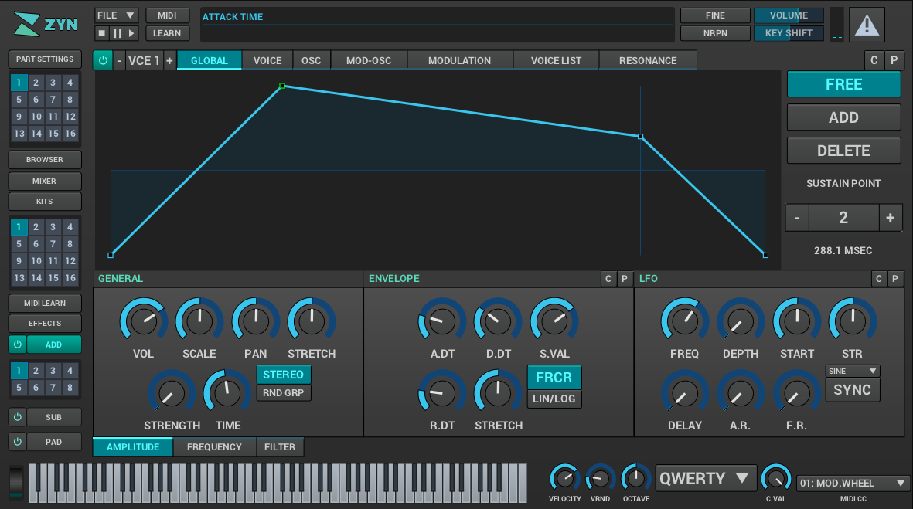

ZynAddSubFX
-----------

image::https://travis-ci.org/zynaddsubfx/zynaddsubfx.svg?branch=master[alt="Build status", link="https://travis-ci.org/zynaddsubfx/zynaddsubfx"]

ZynAddSubFX is a fully featured musical software synthesizer for Linux, MacOS,
BSD, and Windows.
ZynAddSubFX exposes a wide array of synthesis parameters to make it flexible
tool for sound design and a fun experience for playing instruments.

Features
~~~~~~~~

*   Polyphonic with support for legato and mono playing modes
*   Three synthesizer engines:
**      Additive Synthesis for classic synth sounds composed of a variety of voices with powerful modulation. This exposes modulators ranging from LFOs and envelopes to oscillator modulators for FM, PM, and AM.
**      Subtractive Synthesis for creating variable bandwidth harmonics from filtered white noise
**      PAD synthesis for creating beautiful pads and other instruments
*   Powerful waveform generator with up to 128 sine/non-sine harmonics
*   A variety of filters including analogue modeled filters, formant filters, and state variable filters.
*   Envelopes can have ADSR (or ASR, etc..) modes or can be free modes (with any shape)
*   Effects for Reverb, Echo, Chorus/Flange, Phasing, Wave-shaping, Equalizing, Dynamic Filtering with flexible signal routing
*   Instruments can be organized in kits, which allows you to make drum kits or layered instruments; this makes possible to use more than one instrument for a single part. It is possible to choose what items from the kit should be processed by the Part's effects.
*   Randomness settings to create subtle differences in each sound to help create that familiar analogue warmth.
*   Microtonal capabilities with any scale, up to 128 notes per octave, and key mapping
*   Extensive MIDI/Audio driver support including JACK, ALSA, OSS, and PortAudio
*   Session Management Support via LASH/NSM
*   Plugin Support via DSSI/LV2/VST
*   Over 1100 high quality instruments included

For more information see:

- The project page: http://zynaddsubfx.sf.net
- The mailing list: http://lists.sourceforge.net/mailman/listinfo/zynaddsubfx-user
- The public forum: http://www.kvraudio.com/forum/viewforum.php?f=47
- The IRC channel: ##zynaddsubfx on freenode

Dependencies
~~~~~~~~~~~~

ZynAddSubFX depends on a number of dependencies for building.
For more information on building the core along with the FLTK based interface
see doc/building.txt and for building the new interface see
https://github.com/zynaddsubfx/zyn-fusion-build

Required:

- FFTW 3.x.x  - necessary for Fast Fourier computations
- MXML-2.5+   - from www.minixml.org
- zlib library from http://www.zlib.org
- Liblo - networked open sound control

Optional:

- FLTK (for the old user interface)
- NTK  (for the old user interface)
- JACK
- OSS
- ALSA
- CxxTest (for unit tests)
- LASH
- DSSI

Sibling projects:

- rtosc - realtime open sound control https://github.com/fundamental/rtosc
- mruby-zest - the framework for the zyn-fusion GUI
               https://github.com/mruby-zest/mruby-zest

License
~~~~~~~

ZynAddSubFX is available under the GPLv2+ license.

Have fun! :-)

--The ZynAddSubFX team
